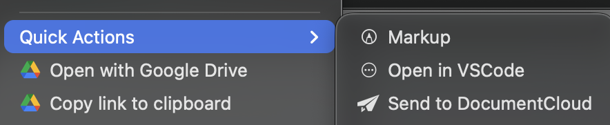

# DocumentCloud Upload Quick Action

This is an Automator file for MacOS that adds a Quick Action to your finder right click menu to upload a file (or files) to [DocumentCloud](https://www.documentcloud.org/).

## Installation

1. **Download the workflow**: 
    - Download the repository as a ZIP file: [Download ZIP](https://github.com/nielsenau/finder-documentcloud/archive/refs/heads/main.zip)
    - Unzip the downloaded file
    
2. **Install the Quick Action**: 
    - Double-click the `Send to DocumentCloud.workflow` folder - macOS will recognize it as executable and install it automatically
    - If that doesn't work, manually move the `Send to DocumentCloud.workflow` folder to `~/Library/Services/`

2. **Set up credentials**:
   - The workflow will prompt you to enter your DocumentCloud/MuckRock credentials on first use
   - Credentials are securely stored in your macOS Keychain

## How To Use 

1. **Select files** in Finder that you want to upload to DocumentCloud
2. **Right-click** and choose **Services > Send to DocumentCloud**
3. **Follow the prompts**:
   - Enter document title (for single files)
   - Select or create a project (optional)
   - Choose public or private access
4. **Wait for upload** - you'll get a notification when complete
5. **View your document** - the uploaded document will open in your browser or, in if you uploaded multiple, the project page. 

## DEMO 

## Requirements

- Python (Should be pre-installed on macOS)
- The [python-documentcloud](https://documentcloud.readthedocs.io/en/latest/) wrapper (automator will install it for you on first run if it doesn't already exist)
- [DocumentCloud/MuckRock](https://muckrock.com) account

## Troubleshooting

- If the python-documentcloud package fails to install, run this manually in your terminal: `pip3 install python-documentcloud`
- Check the log file (opened automatically on errors) for error information

I love making tiny, quality of life tools for reporter workflows. Let me know if you're using this (and if you have any suggestions or questions) by shooting me an email at [nielsenau@gmail.com](mailto:nielsenau@gmail.com). 